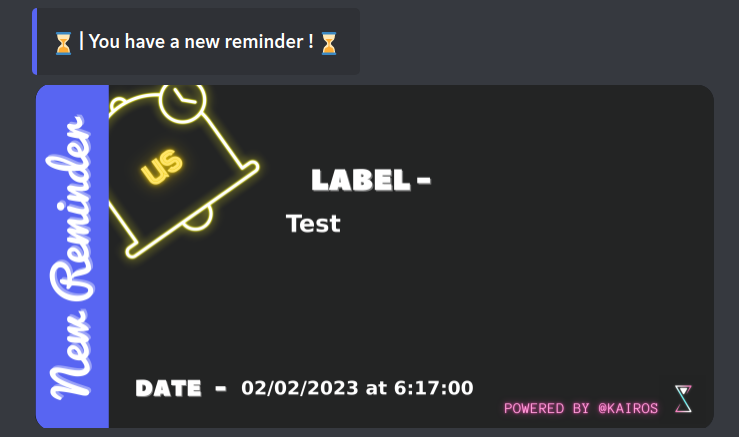

# Reminder Discord Bot | Kairos#9720

This project is a Reminder Discord bot. It is coded in Node TypeScript and also in SQL (MySQL)

---

## Introduction

> I'll try for this **Readme** to be as consise as possible, and use **instead** the [GitHub Wiki]() to explain more in depth the different features of the bot !

So feel free to navigate through the [Wiki]() to get more information about the bot !

---

## Table of Contents

1. [Introduction](#introduction)
2. [Glance to the main features](#glance)
3. [Add It on your Discord Server !](#add_bot)
4. [Open Source](#open_source)
5. [License](#license)
6. [Thanks](#thanks)

---

## Glance to the main features

> - `🔔` Remind you of something at a specific time for yourself
>   

> - `📅` Remind the guild of something at a specific time
>   

> - `⌚` Timetrack your work !

Find more examples documentation just here [Excel](DisplayTime_2023-1-15.ex.xlsx) and [PNG Graph](PolarAreaGraph.ex.png)

---

## Add the Bot on your server !

Feel free to add the Discord Bot on your own server ! Just click on that [link](https://discord.com/oauth2/authorize?client_id=955923021732913254&permissions=414666189889&scope=bot) and [authorize](https://cdn.discordapp.com/attachments/739553949199106158/956552088454832128/Capture_decran_2022-03-24_145317.png) the bot to join your server !

---

## Bot Open Source

> - Feel free to use this code with your own bots and edit the code as you wish !
> - This Bot is made in order to be used in more than one Discord server, you can invite it with that [link](https://discord.com/oauth2/authorize?client_id=955923021732913254&permissions=414666189889&scope=bot)
> - The bot is at his second version, the first one was made in JavaScript. You can still find the first release [here](https://github.com/Eric-Philippe/Kairos-Bot-Reminder/releases/tag/v1.2.1)

---

## License

This Discord Bot is licensed under the GPL 3.0 license. See the file `LICENSE` for more information. If you plan to use any part of this source code in your own bot, I would be grateful if you would include some form of credit somewhere.

---

## Thanks !

> Thanks for checking out the ReadMe !
> Contact Sunrise#1318 If you need anything !
